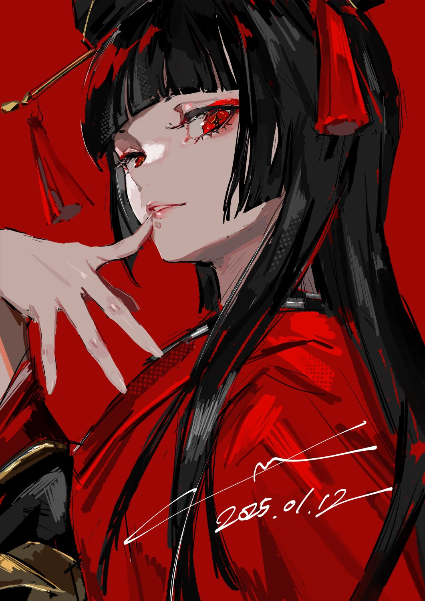
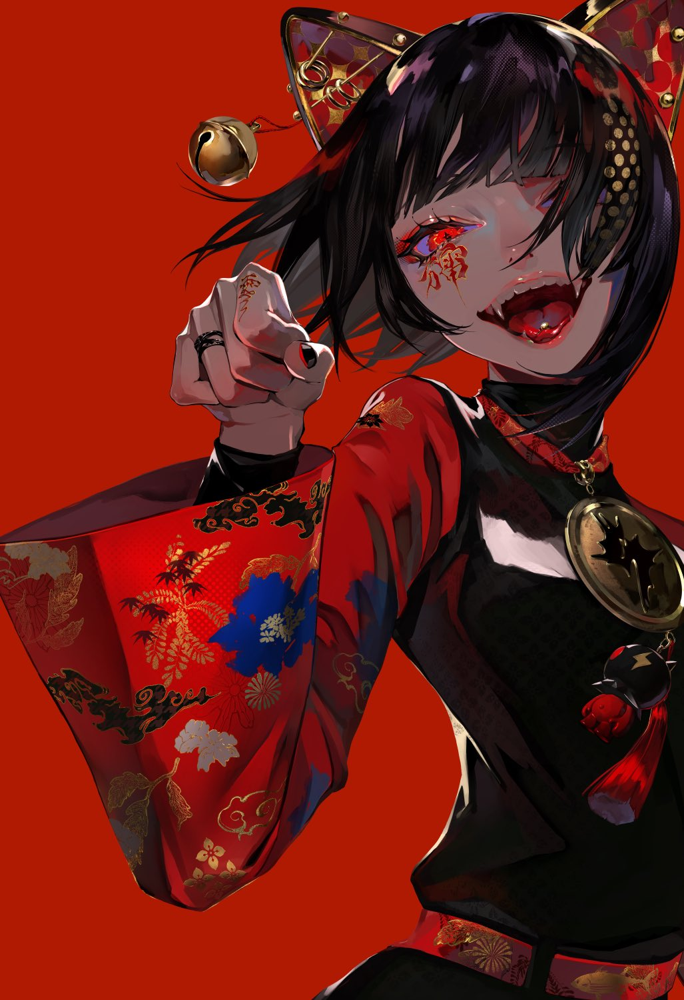

  

    
    
  

  

    <samp>
      language:
      <a href="https://kotlinlang.org/">kotlin</a>,
      <a href="https://www.oracle.com/java/technologies/java-se-glance.html">java</a>
       
      database:
      <a href="https://www.mongodb.com/">mongodb</a>,
      <a href="https://www.sqlite.org/index.html">sqlite</a>
       
       
      site:
      <a href="https://tatsuwuki.com">♡</a> 
      discord:
      <a href="https://discord.com/users/323071398551486467">tatsuwuki</a> 
      art by <a href="https://twitter.com/flat_fish_">@flat_fish_</a>
    </samp>
  

   
  
   
   
  ;3" alt="Discord Presence" align="center" width="272">
   
  
   

